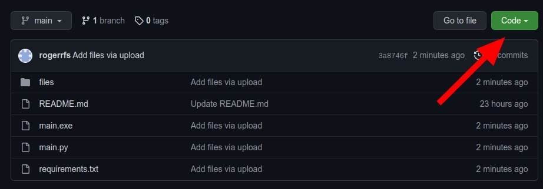
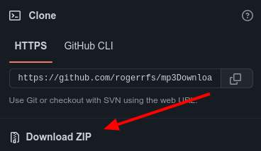

#  EzFAC70R
Factorize any number you want!

Made by: Roger&amp;Pep

## Languages Available

EN &rarr; English

CAT &rarr; Català

ES &rarr; Español

## Installing

### Linux

Python 3 must be installed:

  `sudo apt-get update`

  `sudo apt-get install python3.10.6`

 ####

 Installing the project:

`git clone https://github.com/rogerrfs/EzFAC70R.git`

`cd EzFAC70R/(Language)/`

`python3 main.py`

### Windows

Download the git repo in a zip file:

Extract the zip file, enter the folder and select the language.

Then simply execute the file `EzFAC70R.exe`

#

Enjoy!

Roger Fibla & Pep Rodríguez
